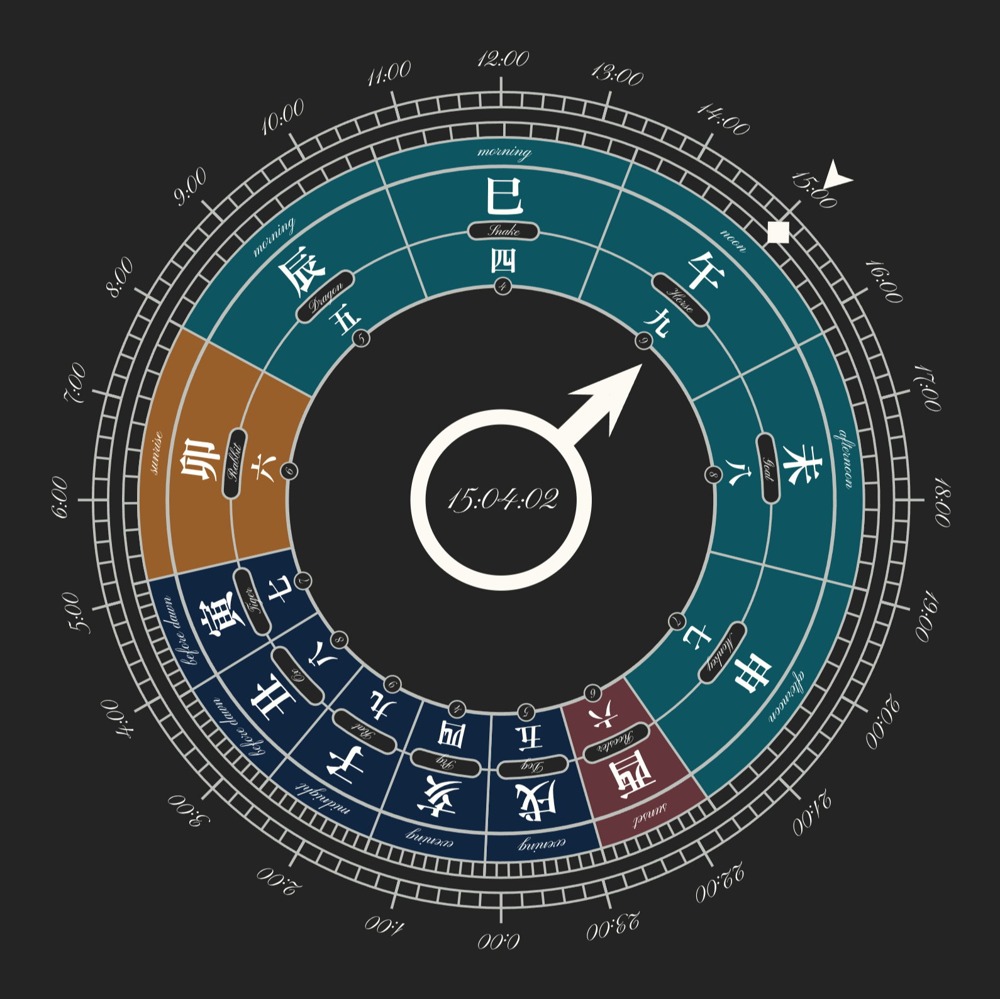

# Wadokei

What does it feel like to measure time the old Japanese way?

  
   
  <em>Wadokei showing today's periods, calculated for the current location.</em>

## About

> Time flows differently when the day is measured by the sun.

Wadokei (和時計) is an animated clock that renders the traditional Japanese time system, where day and night are each divided into six unequal periods - their length shifting with the seasons, tied to sunrise and sunset at your location.

The clock is a single-page web app: no backend, no account, no tracking.
Point your browser at it, share your location, and watch the hand sweep through the day in a way it was measured in the Meiji era.

**[Open Wadokei →](https://janlucaklees.github.io/wadokei/)**

## How it works

The clock face is divided into twelve periods: six for daytime (sunrise to sunset) and six for night (sunset to next sunrise). Unlike a modern clock, the length of each period changes throughout the year — summer days bring long daytime periods and short nights; winter reverses this.

Each period is labeled with:

- a **Chinese zodiac sign** (e.g. 午 · Horse marks noon)
- a **Japanese numeral** (六 through 九, counting inward from the boundary)
- a **solar time name** (sunrise, morning, noon, afternoon, sunset, midnight, before dawn)

A ring of 24 fixed modern hours is also visible on the face, so both time systems can be read side by side.

Granting location access lets the clock calculate precise local sunrise and sunset times, keeping the periods accurate for your latitude and the time of year.

## Donations

The most valuable contribution to this project is your time and ideas. Open source becomes meaningful through people participating in it.

If you would like to support the project financially, you can do so through the following options:

- [PayPal](https://www.paypal.com/donate/?hosted_button_id=8DBMRF3D9GUFY)

Thank you for using, sharing, contributing and/or supporting the project in whatever way makes sense to you.

---

**Wadokei** is a digital reimagining of the traditional Japanese wadokei clock (和時計) - a challenge, an experiment in what a centuries-old way of measuring time actually feels like, and a small act of preservation.
